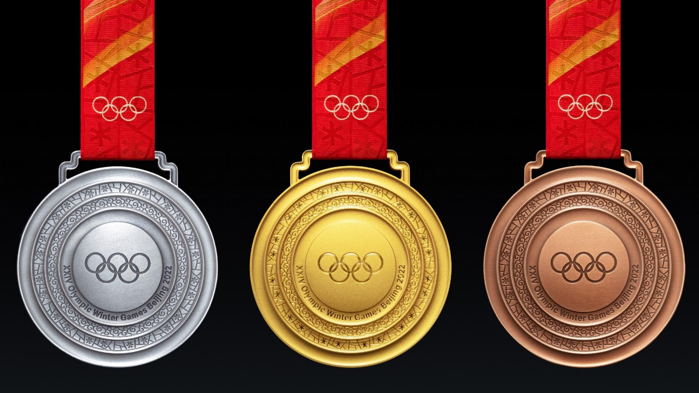
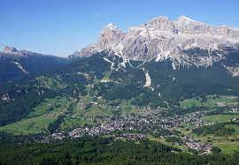

```{r include=FALSE}
#library(readr)
#all_olympics <- read_csv("/cloud/project/data/all_olympics.csv")
#View(all_olympics)
```

```{r load-packages, include = FALSE}
# Add any additional packages you need to this chunk
library(tidyverse)
library(tidymodels)
library(palmerpenguins)
library(knitr)
library(xaringanthemer)
library(ggplot2)
library(hrbrthemes)
library(leaflet)
#install.packages("leaflet")
#install.packages("viridis")
library(viridis)

```


```{r setup, include=FALSE}
# For better figure resolution
knitr::opts_chunk$set(fig.retina = 3, dpi = 300, fig.width = 6, fig.asp = 0.618, out.width = "80%")
```


class: inverse, center
## Introduction
.pull-left[

* In the 2022 Olympics, there were 91 countries and 109 gold medals awarded.

* No athlete from a tropical country has ever won a medal in the Winter Olympics(crazy right?)

* Don't believe us? https://olympics.com/en/news/which-tropical-nation-will-win-an-olympic-winter-games-medal 
* Olympians earn sponsorship from their athletic achievements which allow them to train 
* With better training facilities and/or climate, do they have a better chance at a medal?
]

.pull-right[
```{r cool-runnings, echo = FALSE, out.height = 400, out.width = 600, fig.align = 'right', fig.alt = "Cool Runnings Movie Poster"}

```
.footnote[
####Cool Runnings Movie(1993)
]

]


---

class: inverse, center

## Data Information

.pull-left[
* Pulled from Kaggle databases, was updated with medal count every other day as Olympics went on
* Used WorldBank to get most accurate and recent GDP information
* Summarized climate data by averaging temperature from past 4 years
* Population was from most recent census data(2020)

]

.pull-right[
```{r dataset-image3, echo = FALSE, out.height = 350, out.width = 600, fig.align = 'right', fig.alt = "Three medals, one gold, one silver, one bronze"}

```
]

.footnote[
###### Image: Olympic Medals
]
---
class: inverse, center
#Where our Data Comes From:
.pull-center[

```{r world-map, echo=FALSE, fig.align='center', warning=FALSE, out.width="70%", fig.alt="World map with circles showing countries in data set"}
m <- leaflet() %>%
  addTiles() %>% 
  addCircleMarkers(lng = 19, lat = 60, color = 'red') %>% 
  addCircleMarkers(lng = 5.29, lat = 52, color = 'blue')%>%
  addCircleMarkers(lng = 104.19, lat = 35.86, color = 'purple')%>%
  addCircleMarkers(lng = 10.45, lat = 51.16, color = 'yellow') %>%
  addCircleMarkers(lng = 8.47, lat = 60.47, color = 'pink') %>%
  addCircleMarkers(lng = 12.57, lat = 41.87, color = 'black') %>%
  addCircleMarkers(lng = 105.32, lat = 61.52, color = 'orange') %>%
  addCircleMarkers(lng = 14.55, lat = 47.52, color = 'white') %>%
  addCircleMarkers(lng = 14.99, lat = 46.15, color = 'green' )%>%
  addCircleMarkers(lng = 2.2138 , lat =46.23 , color = 'purple4' )%>%
  addCircleMarkers(lng = 106.35, lat = 56.14, color = 'plum1' ) %>%
  addCircleMarkers(lng = 138.26, lat = 36.20 , color = 'wheat' ) %>%
  addCircleMarkers(lng = 8.2275, lat = 46.82, color = 'steelblue1' )%>%
  addCircleMarkers(lng = 133.87, lat = 25.27, color = 'gold' )%>%
  addCircleMarkers(lng = 15.47, lat = 49.82, color = 'peachpuff1')%>%
  addCircleMarkers(lng = 	174.89, lat = 40.90, color = 'mistyrose2')%>%
  addCircleMarkers(lng = 	95.71, lat = 37.09, color = 'salmon2' )%>%
  addCircleMarkers(lng = 	27.95, lat = 53.71, color = 'forestgreen' )%>%
  addCircleMarkers(lng = 	19.50, lat = 47.16, color = 'maroon2' )%>%
  addCircleMarkers(lng = 	25.75, lat = 61.92, color = 'maroon' )%>%
  addCircleMarkers(lng = 	127.77, lat = 35.91, color = 'palegreen' )%>%
  addCircleMarkers(lng = 	19.15, lat = 51.92, color = 'turquoise2' )
m  # Print the map

```
]

.pull-left[
* A lot of our data comes from Europe 
* Causes a bias in our analysis

]


---
background-image: url(https://cdn.britannica.com/90/198290-050-12A37C4E/Alberto-Tomba-gold-medal-way-Mens-Giant-1992.jpg?q=60)

class: center
.pull-center[

#Analysis: Medals per Country

]


---
class: inverse, center
##Medals Per Country 

.pull-center[
```{r medals_p, echo = FALSE, warning = FALSE, out.width="70%", fig.align = 'center', echo=FALSE, fig.alt= "Stacked bar plot showing total number of metals per country divided into gold, silver and bronze"}

all_olympics_long <- all_olympics %>%
  pivot_longer(
    cols = c("Gold", "Silver", "Bronze"),
    names_to = "Medal",
    values_to = "Num_Medals"
  )


all_olympics_long %>%
  ggplot(aes(x= fct_reorder(NOC, Total) , y= Num_Medals, fill= factor(Medal, levels= c("Gold", "Silver", "Bronze")))) +
  geom_bar(position = "stack", stat="identity", width= 0.5 ) +
  labs(fill="Medal types",x ="Country", y = "Number of Olympic Medals")+
  theme_minimal() +
  coord_flip() + 
  scale_color_viridis_b()

```
]
---
background-image: url(https://img.olympicchannel.com/images/image/private/t_16-9_1240-700_15x/f_auto/v1538355600/primary/tawjra46vluaxhirp3om)

class: center
.pull-center[

#Regression: Looking at the Numbers

]


---
class: inverse, center
## Regression

.pull-center[
* Our regression function of how the average GDP of a country will affect its gold medal chances are as follows,
* $\hat{AverageGDP_i} = 859910.7+ 353262.9	* GoldMedals_i$
* Our R^2 value was 0.09337504
]

```{r GDP-VS-GOLD , echo = FALSE, warning = FALSE, out.width="70%", fig.align = 'center', echo=FALSE, fig.alt= "Linear regression showing correlation between gold medals and average GDP" }
gdp_gold <- linear_reg() %>%
  set_engine("lm") %>%
  fit(Avg_GDP ~ Gold, data = all_olympics)
gdp_gold %>%
  tidy()
glance(gdp_gold)$r.squared

```

---
background-image: url(https://images.unsplash.com/photo-1565992441121-4367c2967103?ixlib=rb-1.2.1&ixid=MnwxMjA3fDB8MHxzZWFyY2h8Mnx8c2tpfGVufDB8fDB8fA%3D%3D&auto=format&fit=crop&w=600&q=60)

class: center
.pull-center[

#Percentage of Athletes in a Country

]
---
class: inverse, center
## Population vs Athletes
```{r athletesVSpopulation, echo=FALSE}
ggplot(all_olympics, aes(x = Population, y = Num_Athletes, color = NOC, xlim=(1000)))  + xlab("Population") + ylab("Number of Athletes") +
  geom_point(shape = 16, size = 5) +
  theme_minimal()
```
---
background-image: url(https://olympics.nbcsports.com/wp-content/uploads/sites/10/2022/02/GettyImages-1371324086.jpg
class: center
.pull-center[

#Medal Counts
]
---
class: inverse, center
###Further analysis, showing medal counts
```{r sam2nd, echo=FALSE}
ggplot(all_olympics, aes(x = Num_Athletes, y = NOC, color = Total)) +
  xlab("Number of Athletes") + ylab("Country") +
  geom_point()
  theme_minimal()

```

---
background-image: url(https://i.guim.co.uk/img/media/cf1422c8bb2370cb5a476ca1a3e36239c45b0e7b/0_103_5042_3026/master/5042.jpg?width=620&quality=45&auto=format&fit=max&dpr=2&s=1a4fd633120584d2d3fb5887b12806ff)
class: center
.pull-center[

#Temperature vs Medal Count
]

---
class: inverse, center
#Heatmap: Temperature vs Medal counts
```{r heat-map, echo = FALSE}
all_olympics <- all_olympics %>% mutate(temp_cat = case_when(Avg_Temp <= 0 ~ "Below Zero",
                                             Avg_Temp > 0 & Avg_Temp <= 4 ~ "0-4 degrees", Avg_Temp > 4 & Avg_Temp <= 8 ~ "4-8 degrees", Avg_Temp > 8 & Avg_Temp <= 12 ~"8-12 degrees", TRUE ~ "Above 12")) %>% drop_na(NOC)

ggplot(all_olympics, aes(fct_reorder(NOC, Total), fct_reorder(temp_cat, Avg_Temp), fill= Total)) +
  geom_tile() +
  scale_fill_gradient(low="white", high="blue") +
  coord_flip() +
  labs(x = "Country",
       y = "Average Winter Temp (degrees celsius)",
       fill = "Total Olympic Medals",
       title = "Correlation between Total Winter Olympic 2022 Medals won By Country with Temp") +
  theme(axis.text.x = element_text(angle = 60, hjust = 1, vjust = 1))
  
```
```{r image-2, echo=FALSE}
style_xaringan(
  title_slide_background_image = "img/olympics1.jpg"
)
```


---
class: inverse, center
###What our Goals were 
.pull-center[
* Hypothesis: Olympians who live in a warmer climate or receive less funding are less likely to get attention or achieve good results
* Goal 1: Investigate for a correlation between both average temperature and medal count 
* Goal 2: Investigate for a correlation between GDP and medal count

]

What we Achieved 
.pull-center[
* Low R^2 value between gold medals and average GDP
* Heat map shows possibility of temperature and medals correlation
* More variables need to be included
]

```{r dataset-image4, echo = FALSE, out.height = 200, out.width = 300, fig.align = 'right', fig.alt = "Red question mark and white man"}
knitr::include_graphics("img/question.jpg")
```


---
class: inverse, center
.pull-center[
#Future Research 
* Add more countries from different regions
* Group sports into bigger categories
* Observe temperatures from a wider range of years
* Look into economic downturns vs Olympic years
* Compare Summer vs Winter impacts of temperature

]

.pull-center[
```{r mountain-italy, echo = FALSE, out.height = 400, out.width = 600, fig.align = 'right', fig.alt = "Snowy mountain in Italy"}

```
.footnote[
####Mountain in Cortina d'Ampezzo
]


]

```{r image-2-olympic, echo=FALSE}
style_xaringan(
  title_slide_background_image = "img/olympics1.jpg"
)
```
